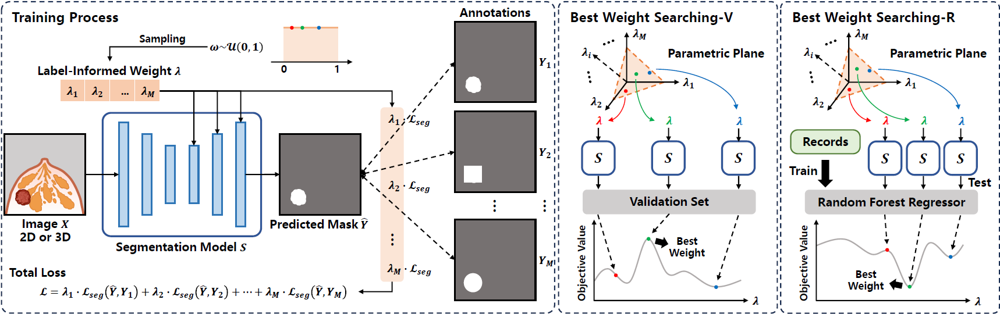

# Multi-Annotation Adaption: A Label-Informed Dynamic Framework for Medical Segmentation and Localization


<p align="center">

<p>

> **Multi-Annotation Adaption: A Label-Informed Dynamic Framework for Medical Segmentation and Localization**<br>
> [Luyi Han](https://fiy2W.github.io/), Lishan Cai*, Tao Tan, Tianyu Zhang, Yuan Gao, Xin Wang, Chunyao Lu, Xinglong Liang, Antonio Portaluri, Katja Pinker-Domenig, Yue Sun, Jonas Teuwen, Regina Beets-Tan, Sean
Benson, and Ritse Mann
> <br>⋆ Lishan Cai and Luyi Han contributed equally to this work.
> <br>MPU, Radboudumc, NKI<br>

## 🌿 Abstract
In medical imaging, particularly for lesion segmentation and localization, leveraging weakly supervised learning can significantly reduce the annotation burden. However, the challenge often lies in finding the right balance between annotation time and accuracy. In this study, we address this issue by introducing a balanced approach that uses a multiannotation pattern.We propose a plug-and-play, label-informed dynamic
framework, referred to as MALFOY, designed to efficiently learn from various types of annotations, such as masks, bounding boxes, points, etc. During the training phase, the model is informed of the types or styles of
annotations through label weights, which are then linked to the losses for different annotations. Upon completion of training, the optimal segmentation or detection is determined by searching for the best label weights on training records or validation set, guided by specific objective values. Our experiments span two distinct datasets: a polyp dataset comprising 3,515 2D colonoscopy images and a breast cancer dataset containing 1,315 3D DCE-MRI images. The results demonstrate that our proposed model is capable of (1) maximizing the use of diverse annotations through label weights, (2) effectively integrating knowledge from various sources by identifying the optimal weights, (3) performing robustly across both 2D and 3D images while reducing the reliance on precise mask annotations, and (4) can be easily extended for multi-expert annotations.

## 🔗 Citation
If you find our work useful for your research and applications, please cite using this BibTeX:

```bib
Coming soon!
```

## 🙏 Acknowledgements

<span>


</span>

## ✉️ Contact
For any code-related problems or questions please [open an issue](https://github.com/fiy2W/AsynDiff/issues/new) or concat us by emails.

- Luyi.Han@radboudumc.nl (Luyi Han)
- taotan@mpu.edu.mo (Tao Tan)